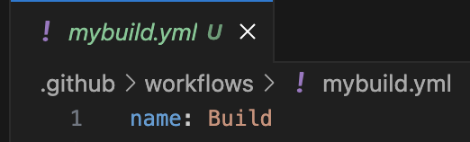

# Github Actions & Workflows (BLUI)
## Build and Test with Node.js
### See the official doc [here](https://docs.github.com/en/actions/use-cases-and-examples/building-and-testing/building-and-testing-nodejs).

This repository contains the Brightlayer-UI React Routing template starter project and is the starting point for experimenting with basic Github Actions & Workflows. For this projects continuous integration (CI) we will focus only on the actions / workflow and the available scripts in package.json.

There are two ways to implement the (CI) .yml file for any project in github, the first way is to create and edit the workflow .yml file in the actions tab in the repository and the second way is to commit & push the .yml file. For this we will just commit the .yml in to your new repository via a pull request and the workflow will be triggered to run once everything is setup.

-   Fork this repository and <ins>create a new repository under your github profile.</ins>
```
https://github.com/JeffGreiner-eaton/react-routing-action-workflow.git

```
-   Clone down your new repository that was created and in the root of the project create a hidden folder `.github`. After creating the .github folder create a sub-folder in the .github called `workflows`.

-   Create a new file in workflows folder called `mybuild.yml` or similar.


-   To help author the .yml you can install the VS Code extension GitHub Actions v0.26.X
-   In the new .yml file, the first line will contain the workflow name that will be displayed in the github repository actions once the first workflow runs. On the first line of the .yml add ``` name: Build ```. The name value can be anything to represent what the workflow is.



-   In the next section of the .yml workflow file we will setup the `on:` key trigger events that will trigger the workflow to run. For Brightlayer-UI we tend to use three event types:
` on: push:` ` on: pull_request:` ` on: pull_request_target:`

-   On line 3 add the `on:` key and event types.
```yaml
on:
  push:
    branches: [ "dev", "master" ]
  pull_request:
    branches: [ "dev", "master" ]
  pull_request_target:
    types:
      - opened
    branches:
      - '*/*'
```

See the official docs [here](https://docs.github.com/en/actions/writing-workflows/workflow-syntax-for-github-actions#on) for additional event types.

-   The workflow .yml file is now setup with run name and on: trigger event types.


-   In the next section of the workflow, assigning permissions for jobs. You can use permissions to modify the default permissions granted by Github and you can use permissions either as a top-level key, to apply to all jobs in the workflow, or within specific jobs. For Brightlayer-UI we use top-level key permissions and tend to use this permission setup for the `on:` key event type `pull_request_target` and permits forked pull requests to run our workflow and jobs.

-   On line 14 add the `permissions:` key and the types.
```yaml
permissions:
  pull-requests: write
  contents: read
```

See the official docs [here](https://docs.github.com/en/actions/writing-workflows/choosing-what-your-workflow-does/assigning-permissions-to-jobs) for additional permission types.


-   The last section of the .yml workflow file is the jobs section. This section is where we define what actions will run when the workflow is triggered. For this repository the jobs section will contain the checkout action, setup-node action and the commands to run prettier, lint, build and test that are referenced in package.json.

- On line 18 add the `jobs:` key and then the job id `prettier_lint:` with `runs-on:` key using ubuntu-latest.

```yaml
jobs:
  prettier_lint:
    runs-on: ubuntu-latest
```

-   The `runs-on:` key with image runner `ubuntu-latest` is used by GitHub Actions and is the hosted virtual environment offering a quicker, simpler way to run your workflows. <ins>Self-hosted</ins> runners are highly configurable way to run workflows in your own custom environment that would have to be maintained by the team.

See the available hosted runners [here](https://github.com/actions/runner-images)

-   In the jobs section, continue on line 22 and add the `strategy:` id key with the `matrix:` key using `node-version`. The matrix strategy lets you use variables in a single job definition to automatically create multiple job runs that are based on the combinations of the variables. In this setup we use node-version 18.X and you can add other versions of node that will trigger multiple runs. Example `node-version: [16.x, 18.x, 20.x]`

See the official doc on matrix strategy [here](https://docs.github.com/en/actions/writing-workflows/workflow-syntax-for-github-actions#jobsjob_idstrategy).

```yaml
jobs:
  prettier_lint:
    runs-on: ubuntu-latest

    strategy:
      matrix:
        node-version: [18.x]
```


-   In the jobs section, continue on line 26 with the `steps:` key with `name:` id step name. This is the section where we define what the job will execute and using the `actions/checkout@v4` Github action that checks-out the repository under $GITHUB_WORKSPACE, so the workflow can be accessed. The `uses:` key id is the location and version of a reusable workflow file to run as the job.

```yaml
    steps:
    - name: Checkout
      uses: actions/checkout@v4
```


See the `actions/checkout` repository readme [here](https://github.com/actions/checkout) for more information.

See the uses key official docs [here](https://docs.github.com/en/actions/writing-workflows/workflow-syntax-for-github-actions#jobsjob_iduses).


-   In the jobs section, continue on line 29 and add another `name:` id step name with `uses:` key for Node.js and using the actions/setup-node@v4 with node version.

```yaml
    - name: Use Node.js ${{ matrix.node-version }}
      uses: actions/setup-node@v4
      with:
        node-version: ${{ matrix.node-version }}
        cache: 'yarn'
```


See the `actions/setup-node` repository readme [here](https://github.com/actions/setup-node).

- The job steps setup section should look like the image above and now the job has been defined to use actions/checkout with actions/setup-node using the value from the matrix with cache of yarn. Cache yarn at the time of testing workflows seemed to speed job runs a bit but isn't always needed.

-   In the jobs section, continue on line 34 and add the `run:` key with yarn (install), line 35 add another `run:` key with yarn prettier and lastly add `run:` key with yarn lint.

```yaml
    - run: yarn
    - run: yarn prettier
    - run: yarn lint
```

See the `run` key docs [here](https://docs.github.com/en/actions/writing-workflows/workflow-syntax-for-github-actions#defaultsrun)

-   The prettier_lint job and steps are complete and should look like this.


-   This is the opportunity to see if the workflow and job runs in your repository. Open a new pull request in your new repository. Once your PR is open, select the actions tab in the repository. Verify your new workflow name (Build) is reflected in the left side-nav and select it. Verify the prettier_lint job is listed and complete. Double click the job folder to view the content of the run. Note: if the job failed, double click on it to see error.


-   Add the unit_test job below the prettier_lint job. The setup for this job is similar to the prettier_lint job. Re-use the prettier_lint job and copy/paste. Modify the job name and `run:` keys for testing.

```yaml
  unit_test:
    runs-on: ubuntu-latest

    strategy:
      matrix:
        node-version: [18.x]

    steps:
    - uses: actions/checkout@v4
    - name: Use Node.js ${{ matrix.node-version }}
      uses: actions/setup-node@v4
      with:
        node-version: ${{ matrix.node-version }}
        cache: 'yarn'
    - run: yarn
    - run: yarn test --watchAll=false
```
-   Commit and push the job to your open pull request. Verify the workflow run and job from the actions tab in the repository. Double click on the unit_test job folder to view the contents.


-   Add the build job below the unit_test job. The setup for this job is similar to the unit_test job. Re-use the unit_test job and copy/paste it below the unit_test job. Modify the job name and `run:` keys for build_project. In this job we add another action called `actions/upload-artifact` and this action will upload the build or dist folder to the artifacts section of the workflow run.

See the `actions/upload-artifact` repository readme [here](https://github.com/actions/upload-artifact).

```yaml
  build_project:
    runs-on: ubuntu-latest

    strategy:
      matrix:
        node-version: [18.x]

    steps:
    - uses: actions/checkout@v4
    - name: Use Node.js ${{ matrix.node-version }}
      uses: actions/setup-node@v4
      with:
        node-version: ${{ matrix.node-version }}
        cache: 'yarn'
    - run: yarn
    - run: yarn build
    - name: Save build
      uses: actions/upload-artifact@v3
      with:
        name: build
        if-no-files-found: error
        path: build
```

-   Commit and push the job to your open pull request. Verify the workflow run and job from the actions tab in the repository. Select the build workflow job from the left nav to view all the job folders, then scroll to the bottom of the page to verify the `actions/upload-artifact` saved the build folder. Double click on the build_project job folder to view the contents of the job details.


# Github Actions & Workflows Continued
## Publishing packages to NPM (@brightlayer-ui)

The publish step in a workflow is another job that can be added if you have a node package to publish to NPM.
-   This can be the last job in a workflow and it should contain the `needs:` key that sets the publish job not to run until all other important jobs complete and pass the checks. The `needs:` key is an array of the job names within the workflow. Example `needs: [prettier_lint, unit_test, build_project]`

-   The publish job also contains an `if:` key as a conitional run type based on the `github.ref (master or dev branch)` push events. In a job the if condition is set like this `if: ${{ github.event_name == 'push' && (github.ref == 'refs/heads/master' || github.ref == 'refs/heads/dev') }}`. 
-   Key information for brightlayer-ui publishing:
    - The `dev` branch will publish versions marked as `alpha` or `beta`.
    - The `master` branch will publish any version (`alpha`, `beta`, or `latest`).
    In both cases, the code will only be published if the version number differs from the current version published under the respective dist tag.

-   The repository projects package.json scripts section will need updated if it does not contain the `publish:package` Example: `"publish:package": "cd dist && rm -f *.tgz && set npm_config_yes=true && npx -p @brightlayer-ui/publish blui-publish"`. Modify the directory needed for the dist/build folder.

-   The job will also utilize `secrets.NPM_TOKEN` within a `env:` key that the job will use to pass authentication over to NPM via a token to complete the publishing. The repository needs to know about the NPM_TOKEN in the repository settings and actions. Navigate to the settings tab of the repository and expand secrets and variables and select actions. The NPM token is available in the teams adminstration file.


## The publish job

```yaml
  publish:
    runs-on: ubuntu-latest
    if: ${{ github.event_name == 'push' && (github.ref == 'refs/heads/master' || github.ref == 'refs/heads/dev') }}
    needs: [prettier_lint, unit_test, build_project]
    strategy:
      matrix:
        node-version: [18.x]
    env:
      NODE_AUTH_TOKEN: ${{ secrets.NPM_TOKEN }}
      BRANCH: ${{ github.ref == 'refs/heads/master' && 'master' || 'dev' }}
    steps:
      - uses: actions/checkout@v4
      - name: Download dist
        uses: actions/download-artifact@v3
        with:
          name: dist
          path: dist
      - uses: actions/setup-node@v3
        with:
          node-version: ${{ matrix.node-version }}
          registry-url: 'https://registry.npmjs.org'
      - run: yarn --immutable
      - run: npm run publish:package -- -b ${{env.BRANCH}}
```

See the official docs [here](https://docs.github.com/en/actions/use-cases-and-examples/publishing-packages/publishing-nodejs-packages#introduction).

### Modifications and information
-   Update download dist name and path based on the output for given project. (build or dist)
-   The `run: yarn --immutable` --immutable is the same as frozen lock.
-   The `matrix: node-version: [18.x]` use only one version of node for publish.